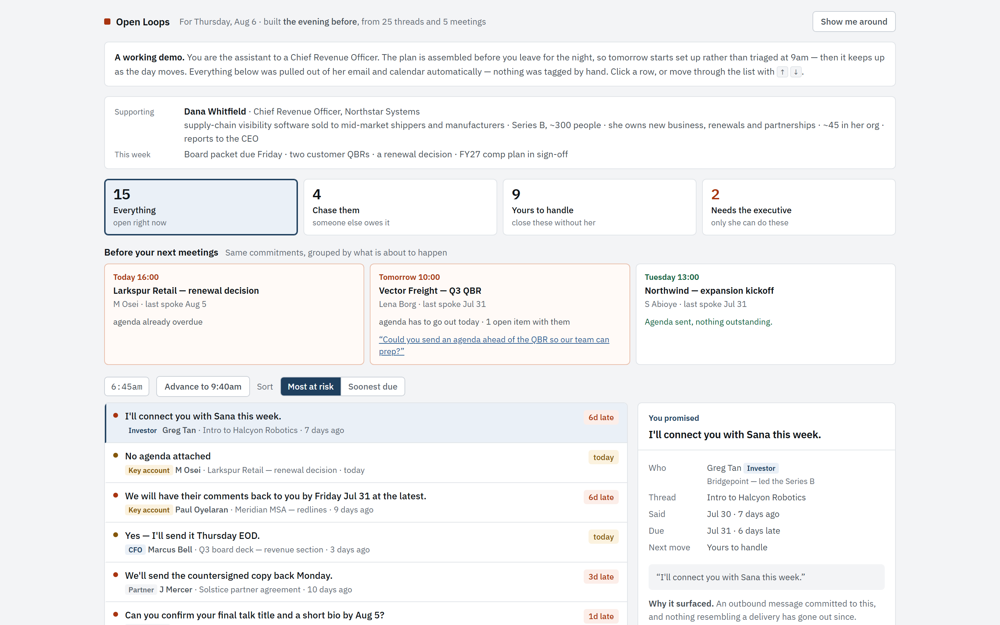

# Open Loops

**Finds the things nobody is chasing — and tells an executive's assistant which is
closest to falling over.**

An executive assistant's real job isn't scheduling — it's being the safety net. Someone
promised something three weeks ago in a thread nobody reopened, and there is no system
anywhere that knows about it. Open Loops reads Slack and the calendar, extracts the
promises, works out which ones closed on their own, and ranks what's left by how close it
is to falling over.

```bash
npx skills add kaarizhussain/open-loops
```

**That is the whole product: a skill.** There is no app and nothing to log into. It reads
your channels and your calendar, posts a ranked list to your own Slack DM each evening,
and you correct it by replying to the message. The output is text, and it looks like
[What comes out](#what-comes-out) below.

---

## What it finds

Seven ways a commitment slips, all detected from message text — none of it tagged by hand.

Five of them fire on **nothing having happened**. That is the whole point, and it is
worth putting first: an assistant already knows about the loud problems. What they need
is the thread that has been silent for three weeks, and silence is the one thing a
summariser cannot surface, because there is nothing there to summarise.

| Signal | What fires it | |
|---|---|---|
| **Unanswered** | An inbound request, and no reply from your side | absence |
| **No reply yet** | You asked a question; silence | absence |
| **No follow-up sent** | An external meeting ended and nothing went out after | absence |
| **Meeting unprepped** | External attendees, no agenda attached | absence · two sources |
| **Agreed, not booked** | A call was agreed to, but no calendar hold exists for it | absence · two sources |
| **You promised** | An outbound commitment with no matching delivery since | a sentence exists |
| **They promised** | An inbound commitment and nothing has arrived | a sentence exists |

The last two are the ones anything can do. Point a good summariser at the same mailbox
and it will find sentences that sound like promises too. The five above it cannot: they
are all statements about what is *missing*, and two of them exist only in the gap
between a mailbox and a calendar — the seam no single-product assistant reaches across.

## What comes out

From 25 threads and 5 meetings, grouped by who acts next:

```
OPEN LOOPS — for 2026-08-06

4 are overdue. The oldest by 6 days is Intro to Halcyon Robotics (Investor).

Read 25 messages across 18 threads and 5 meetings.
15 open · 15 new

NEEDS TO GO OUT TODAY
  [LATE] Larkspur Retail — renewal decision — today, no agenda (m.osei@larkspurretail.com)
  Vector Freight — Q3 QBR — tomorrow, no agenda (lena.borg@vectorfreight.com)

NEEDS THE EXECUTIVE (2) — Only they can produce or decide this — protect the time for it.
 1. [today] Yes — I'll send it Thursday EOD.
      CFO · marcus.bell@northstar.io · Q3 board deck — revenue section
 2. [due 2026-08-08] I'll review and get back to you before the deadline.
      People team · hr@northstar.io · Sales comp plan — sign-off needed
      note: stated 2026-08-08 is a weekend — last working day is 2026-08-07

CHASE THEM (4) — Someone else owes this. Your move is the nudge.
 3. [6d late] We will have their comments back to you by Friday Jul 31 at the latest.
      Key account · paul.oyelaran@meridianhealth.com · Meridian MSA — redlines
 ...
```

It opens with the single worst thing rather than with how many messages it read — a
digest that leads with its own statistics is a system reporting on itself. The three
piles are the assistant's actual working split: what only the executive can do, what
someone else owes you, and what you can close out yourself.

Every line after the first also says what *changed*. The same fifteen items arriving
every morning is a list nobody reads by Thursday — not because it is inaccurate, but
because it is identical. Repetition kills a digest faster than error does, so each item
carries `NEW` or how long it has been sitting there, and anything that dropped off is
reported once as cleared.

Each item carries the sentence it came from and the rule that fired.

### Seeing it without installing it

The text above is the product. This is **not** — it is a browser page that runs the same
detector over an invented mailbox, so the reasoning can be poked at without connecting
anything. Nobody who installs the skill sees this screen; it exists because a ranked list
is easier to argue with when you can click a row and read why it fired.

[](https://kaarizhussain.github.io/open-loops/)

**[▶ Try it](https://kaarizhussain.github.io/open-loops/)** — a synthetic CRO's Thursday.
Click any row for the sentence that triggered it, the rule that fired, and a drafted chase
note. Every name in it is fictional.

## How it works

```
messages + events
   → commitment extraction     cue phrases, per sentence
   → deadline resolution       "Thursday EOD" → 2026-08-06, relative to send date
   → closure matching          did a later message deliver it, and was it that one?
   → silence + meeting checks  unanswered asks, unbooked calls, missing agendas
   → risk ranking              overdue days, proximity, signal type, relationship
   → the ledger                what is new, what cleared, what you already rejected
```

The detector is deterministic and dependency-free. It takes a normalized shape, so the
source is an adapter concern, not an engine concern:

```js
detectLoops(messages, events, { exec: 'dana@northstar.io', today: '2026-08-06' })
```

One adapter ships: [`SLACK.md`](SLACK.md) reads Slack through a connector and posts the
digest back as a DM. It is deliberately the only one — a second runtime was maintained
for a while over Gmail and Calendar, and keeping two consumers honest cost more than the
second one returned. Writing another is a small job, and *Pointing it at something else*
below says exactly what it has to produce.

**Deterministic is load-bearing, not a preference.** No model decides what counts as a
commitment, so the same mailbox produces the same list tomorrow, nothing is sent to a
third party, and the whole thing can be read by someone deciding whether to approve it.
On the Slack path a model fetches and posts; it never judges.

## Who you support

The list of people you support is optional, and empty means nobody — you are reading
your own work, which is the common case for anyone trying this on themselves.

```js
principals: []                          // nobody. Two piles: chase them, and yours.
principals: [{ label: 'Dana' }]         // one. The pile becomes "Needs Dana".
principals: [{ label: 'Dana',   address: 'dana@northstar.io' },
             { label: 'Marcus', address: 'marcus@northstar.io' }]
```

With several, items route by who was actually on the conversation and the name goes on
each line. Leaving it out entirely keeps the original behaviour: one unnamed executive.

## How you argue with it

Marking something wrong has to cost about as much as ignoring it, or it does not happen
for fourteen days running — which is exactly how long it takes to learn anything. So
the digest numbers its items and you reply to it. Nothing to open, nothing to log into.

```
3 7            those two are not real commitments
k 1 4          those are real, but I already knew
miss b         the spot check found something it walked past
```

Three replies, three different numbers, and they measure different things:

**Precision** — of what it showed you, how much was real. Whether it can be trusted.

**Novelty** — of what was real, how much you did not already know. Whether it is worth
reading. Someone with a good memory could get a flawless digest every morning and gain
nothing from it, and precision alone would call that a success.

**Recall** — how much it walked straight past. Nothing else in the loop can see this: a
miss produces nothing to reject, so corrections could only ever teach it to be quieter,
never more thorough. Each digest therefore samples its own silence — a handful of
messages it found nothing in — and asks whether it should have. The two worst bugs
found in this detector were both false negatives, invisible to every other number here.

```
                       ── ILLUSTRATIVE. Not this project's results. ──
Tracked 63 items.
   9 wrong        → 86% held up
  41 already known
  13 genuinely new → 21% told you something
Recall so far: about 84% — 3 misses found in 45 messages spot-checked.
```

Invented numbers, showing the shape of the report. The real ones are in
[Evaluation](#evaluation) and they are thinner: five messages spot-checked, not
forty-five. A reviewer read this block as a result and congratulated the project on it,
which is a fair warning about how a sample renders inside a document that is otherwise
trying hard to state what it does not know.

Past four rejections of the same phrase, with none of them kept, it stops asking and
mutes it — announcing the change, listing it in every digest afterwards, and undoing it
on one line. It learns the kind, not just the instance, because otherwise the same bad
pattern arrives fresh every morning forever.

**Nothing it learns is hidden.** A detector that rewrites its own rules invisibly is one
nobody can predict, and predictability is most of the reason this is regexes instead of
a model.

## The parts that were actually hard

Every real bug in this thing was found by running it against real messages, never by
reading the code. Four separate times, on four different days. A closure rule that let
the word `signed` mark a future promise as already delivered. Deadlines borrowed from
unrelated messages further up a channel. An app footer poisoning the topic match. A
question buried by the sender's own later message, so it vanished instead of ageing.

None were visible in review, and every one looked obvious afterwards.

→ [**What was actually hard**](docs/failures.md) — the full list, and what each broke.

## Quick start

No dependencies, no install, no API keys.

```bash
git clone https://github.com/kaarizhussain/open-loops.git
cd open-loops
npm test              # every suite
node build.js         # rebuilds index.html (downloads fonts on first run)
```

`index.html` is committed, so you can also just open it in a browser. `npm test` fails if
it has drifted behind `src/`, because a demo that silently ships an old detector is worse
than no demo — that happened, and it is the page most people see.

The screenshot at the top is the same page, captured headless. It goes stale the same way
and nothing checks it, so re-run this when the layout changes:

```bash
chrome --headless --hide-scrollbars --force-device-scale-factor=2 \
  --window-size=1440,900 --screenshot=docs/screenshot.png \
  "file://$PWD/index.html#present"
```

`#present` suppresses the guided tour, which otherwise covers the app it is touring.

The tests live in `test/` and are the documentation for how each part is meant to fail:
`test.js` for the detector against the demo fixture, `test_slack.js` and `test_store.js`
for the adapters, `test_ledger.js` for what the digest remembers between runs,
`test_digest.js` for the rendering, `test_slack_run.js` for the whole Slack path end to
end.

## Pointing it at something else

The engine never touches a mail or chat API. Write an adapter producing these two shapes
and nothing in `src/loops.js` changes:

```js
message = { id, threadId, subject, from, to: [], date: 'YYYY-MM-DDTHH:MM', body, attach: bool }
event   = { id, title, start: 'YYYY-MM-DDTHH:MM', attendees: [], agenda: bool, series }
```

Direction is derived from `from` against the reader's own address, so an adapter never
labels inbound or outbound. Two exist: `src/slack.js`, which ships, and
`tools/enron.js`, a benchmark harness of about a hundred lines.

→ [**Writing an adapter**](docs/adapters.md) — the field-by-field mapping, and the
privacy limits that matter more than the shapes do.

## Evaluation

| What it ran on | Size | Labelled? | What it establishes |
|---|---|---|---|
| Demo fixture (`src/fixture.js`) | 25 messages, 5 events | yes, by assertion | that a change has not broken known behaviour |
| A live Slack workspace | 17 messages, one member | 1 rejection, 1 spot check | that the whole path runs unattended |
| Enron corpus (`tools/benchmark.js`) | 3,395 emails, 16 mailboxes | **no** | how often it fires — 35.8 items per 100 |
| Top-of-digest, hand-graded | 79 items, two labellers | yes | that the task is well-posed — kappa 0.76 |

**Read the third row carefully.** 35.8 per 100 is a *firing rate*, not an accuracy. That
corpus has no ground truth, so nothing in it says how many of those were real. It is an
honest answer to "how noisy is this" and no answer at all to "how right is it".

**Precision on real correspondence is still unmeasured.** Nobody has used this for a
fortnight and marked what it got wrong. Until somebody has, every claim here is about the
code and none of it is about results. The machinery to measure that is built and has five
data points in it.

**Three of the seven signals have never fired on anything real.** Two need a calendar the
Slack path only just got. *No follow-up sent* needs a recipient list that chat does not
carry, and now says so rather than firing blind.

Everything in `src/fixture.js` is invented. Dana Whitfield, Northstar Systems and every
counterparty in it are fictional, written to exercise each detector including the cases
that must *not* fire.

→ [**Evaluation in full**](docs/evaluation.md) — the corpus work, the seven hypotheses
that died against it, and why a benchmark can show a filter is consistent but never that
its threshold is right.

## License

MIT — see [LICENSE](LICENSE). Embedded fonts are SIL OFL 1.1; see
[fonts/NOTICE.md](fonts/NOTICE.md).
